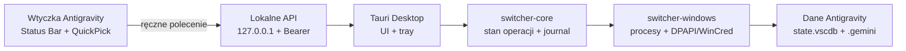

# Antigravity Account Switcher

Windowsowa aplikacja desktopowa i cienka wtyczka Antigravity do **ręcznego** przełączania między własnymi profilami Google używanymi w edytorze. Przełączenie zachowuje dane profilu, aktualizuje aktywne poświadczenie i ponownie uruchamia Antigravity, ponieważ backend edytora odczytuje token tylko przy starcie.

Projekt jest rozwijany jako MVP. Operacje na rzeczywistych profilach wymagają testów na kontrolowanych kontach i kopii zapasowej danych.

## Twarde ograniczenia zakresu

Projekt nie implementuje i nie będzie implementował:

- automatycznego przełączania po 429 lub wyczerpaniu limitu,
- łączenia limitów wielu kont w tle,
- losowych opóźnień, rotacji user-agentów ani innego maskowania ruchu,
- przełączenia bez zamknięcia i ponownego uruchomienia Antigravity.

Każda aktywacja innego profilu wynika z jawnego wyboru użytkownika i modalnego potwierdzenia.

## Architektura



Najważniejsze katalogi:

| Ścieżka | Odpowiedzialność |
| --- | --- |
| `src/` | React/Vite: dashboard, modal potwierdzenia, postęp i recovery. |
| `src-tauri/` | Powłoka Tauri, komendy UI, tray i lokalny serwer HTTP. |
| `crates/switcher-core/` | Niezależny od UI model profili, journal operacji, spójność i rollback. |
| `crates/switcher-windows/` | Windows Credential Manager/DPAPI, wykrywanie ścieżek i zarządzanie drzewem procesów. |
| `extension/` | Cienka wtyczka TypeScript korzystająca wyłącznie z lokalnego API. |
| `docs/decisions/` | Rejestr decyzji architektonicznych (ADR). |

Planowana lokalizacja danych to `%LOCALAPPDATA%\AntigravitySwitcher`. Przed pierwszą mutacją aplikacja musi potwierdzić, że magazyn profili i wszystkie aktywne ścieżki uczestniczące w `move` leżą na tym samym woluminie. Niespełnienie warunku kończy operację bez zmian.

## Przebieg przełączenia

1. Użytkownik wybiera inny profil i potwierdza zamknięcie edytora.
2. Aplikacja zapisuje trwały journal z planem każdej mutacji.
3. Process Manager identyfikuje właściwe drzewo procesów, próbuje je zamknąć grzecznie i dopiero po timeoutcie kończy pozostałe procesy.
4. Po sprawdzeniu blokad aktualny profil jest przenoszony do magazynu, a docelowy do aktywnych ścieżek. Każdy `move` jest osobno odnotowany.
5. Poświadczenie docelowego profilu trafia do Windows Credential Managera.
6. Kontrola spójności poprzedza usunięcie journala i ponowne uruchomienie Antigravity.

Jeżeli aplikacja zostanie przerwana, istniejący journal wymusza ekran recovery. Normalne operacje pozostają zablokowane do wznowienia albo pełnego rollbacku.

## Uruchomienie deweloperskie

Wymagane są Windows 10/11, WebView2, stabilny Rust z targetem MSVC oraz Node.js/npm.

### Aplikacja desktopowa

```powershell
npm install
npm run tauri dev
```

Frontend bez powłoki Tauri można uruchomić przez `npm run dev`. Pełna kontrola jakości zdefiniowana w repozytorium:

```powershell
npm run check
```

Oddzielne testy rdzenia:

```powershell
cargo test --workspace
```

### Wtyczka

```powershell
cd extension
npm ci
npm run check
npm run package
```

Szczegóły konfiguracji i kontrakt HTTP opisuje [extension/README.md](extension/README.md).

## Bezpieczeństwo

- Aktywne poświadczenie pozostaje w Windows Credential Managerze. Kopie profili są chronione przez DPAPI w zakresie bieżącego użytkownika; nie ma fallbacku do plaintextu.
- Lokalny serwer wiąże się wyłącznie z `127.0.0.1`. Każde żądanie wtyczki wymaga niezależnego sekretu Bearer. Sekret API nie jest tokenem Google.
- Logi nie zawierają access tokenów, refresh tokenów, sekretu API ani adresów e-mail. Do korelacji służą losowe `profile_id` i `operation_id`.
- Operacje na ścieżkach odrzucają niezgodny wolumin i powinny odrzucać reparse points kierujące poza oczekiwane korzenie.
- Mutacje są sekwencyjne i chronione pojedynczym lockiem operacji. Sam debounce UI nie jest mechanizmem współbieżności.
- Silnik samodzielnego odświeżania OAuth pozostaje wyłączony do czasu potwierdzenia parametrów klienta Antigravity. Repozytorium nie zawiera rzeczywistych identyfikatorów ani sekretów OAuth.

Ustawienia wtyczki zawierają lokalny sekret transportowy w konfiguracji maszyny. Nie należy wklejać tam poświadczeń Google ani publikować pliku ustawień.

## Lokalne API wtyczki

Kontrakt MVP obejmuje tylko:

- `GET /api/v1/status`,
- `POST /api/v1/app/show`,
- `POST /api/v1/profiles/{profileId}/activate`.

Nie istnieje endpoint automatycznego failover ani endpoint przydzielania zapytań do puli kont. Klient nie ponawia automatycznie odpowiedzi 429.

## Decyzje architektoniczne

- [ADR-0001: DPAPI dla poświadczeń profili](docs/decisions/0001-dpapi-profile-credentials.md)
- [ADR-0002: twardy błąd dla różnych woluminów](docs/decisions/0002-same-volume-hard-fail.md)
- [ADR-0003: journal każdej operacji move](docs/decisions/0003-per-move-operation-journal.md)
- [ADR-0004: wyłączone odświeżanie OAuth](docs/decisions/0004-oauth-refresh-disabled.md)
- [ADR-0005: dynamiczne drzewo procesów](docs/decisions/0005-dynamic-process-tree.md)
