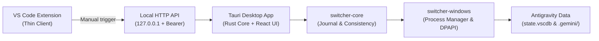

# Antigravity Account Switcher

> A Windows desktop application and VS Code/Antigravity editor extension designed to manually switch between Google Accounts (Gemini PRO) without losing local settings or agent context.

[](https://opensource.org/licenses/MIT)
[](#development)
[](#roadmap)

---

> [!WARNING]
> This project is in **Early Development (WIP)** and is not yet feature-complete. Make sure to back up your profiles and settings before attempting manual switches on production accounts.

---

## Why This Exists

The Antigravity editor (and its Go language server) reads and loads the Google OAuth token *only once* at startup. If you use multiple paid PRO accounts, switching between them manually requires signing out, signing in, and losing your agent history/settings. 

**Antigravity Account Switcher** solves this by automating the editor lifecycle: shutting down the editor gracefully, safely backing up and swapping SQLite database states (`state.vscdb`), agent brain/conversations directories (`.gemini/`), updating the Windows Credential Manager under the hood, and then restarting the editor with your target account.

---

## Hard Scope Constraints

To maintain security, privacy, and prevent account bans, this implementation strictly adheres to the following boundaries:

- **No auto-failover**: The app does NOT automatically switch accounts when encountering HTTP 429 (Rate Limit) errors.
- **No connection masking**: No random delays, User-Agent rotations, or VPN routing is implemented to bypass Google's fraud detection.
- **No background pooling**: The app does NOT query or refresh inactive accounts' quotas in the background.
- **No hot-swapping**: Token swaps require closing and restarting the editor because the Go language server caches tokens in memory.

Every account switch is a deliberate, manual action initiated and confirmed by the user.

---

## Architecture



### Directory Structure

| Path | Description |
|---|---|
| `src/` | React / Vite UI (Dashboard, confirmation modals, progress bar, recovery screen). |
| `src-tauri/` | Tauri container, IPC commands, system tray lifecycle, and background HTTP server. |
| `crates/switcher-core/` | UI-agnostic profile models, operation journaling, consistency validations, and atomic rollback. |
| `crates/switcher-windows/` | Windows-specific utilities (Credential Manager, DPAPI protection, dynamic process tree termination). |
| `extension/` | VS Code / Antigravity editor thin extension client that talks to the local HTTP API. |
| `docs/decisions/` | Architecture Decision Records (ADRs). |

---

## Switching Flow Lifecycle

1. **User Action**: The user selects a target profile and confirms that they want to close the editor.
2. **Journal Lock**: The app writes a persistent, versioned transaction journal (`switcher.lock`) detailing the planned mutation.
3. **Graceful Terminate**: The Process Manager gathers the complete process tree of the editor (renderer, helper processes, Go language server), attempts a graceful window close, and falls back to a force-kill if it times out (8s limit).
4. **Directory Swap**: Once file locks are released, the current profile's `.gemini` brain, conversations, and `state.vscdb` are moved into the profile storage. The target profile's data is then moved to active directories.
5. **Credential Import**: The target profile's token is decrypted and written to the Windows Credential Manager under `gemini:antigravity`.
6. **Consistency Check**: Verification hashes are recalculated. If successful, the journal is deleted and the editor is relaunched.

If the operation is interrupted, the app displays a **Recovery Screen** upon startup. Further actions are blocked until the user rolls back or resumes the operation.

---

## Development & Setup

### Prerequisites

- Windows 10/11
- WebView2 Runtime
- Stable Rust (MSVC toolchain)
- Node.js (v18+) & npm

### Setup Desktop Application

1. Install Node dependencies:
   ```powershell
   npm install
   ```
2. Start the Tauri dev server:
   ```powershell
   npm run tauri dev
   ```

To run quality checks (frontend build + Rust cargo checks and unit tests):
```powershell
npm run check
```

Or run Rust tests separately:
```powershell
cargo test --workspace
```

### Setup VS Code Extension

1. Navigate to the extension folder:
   ```powershell
   cd extension
   ```
2. Install dependencies:
   ```powershell
   npm ci
   ```
3. Compile the extension bundle:
   ```powershell
   npm run package
   ```

For configuration contracts and API detail, see the [extension/README.md](extension/README.md) documentation.

---

## Security Specifications

- **Token Protection**: Active credentials are stored in the Windows Credential Manager. Inactive profiles are encrypted on disk via **DPAPI** (`CryptProtectData`) using the current Windows user context. Plaintext tokens are never written to files.
- **Localhost Binding**: The background HTTP server binds strictly to `127.0.0.1`. Requests from the extension are authenticated with a cryptographically secure `Bearer` transport token.
- **No Email Leakage**: General application logs (`logs/switcher.log`) only use UUIDs (`profile_id` / `operation_id`). User email addresses are kept strictly within the UI.
- **Single-Volume Hard Constraint**: All directory move operations require source and destination folders to reside on the same drive volume to ensure atomic `rename` operations (preventing slow, non-atomic cross-volume copy operations).

---

## Architectural Decision Records (ADRs)

Detailed rationale for our design choices can be found in our ADR registry:
- [ADR-0001: DPAPI for Profile Credentials](docs/decisions/0001-dpapi-profile-credentials.md)
- [ADR-0002: Same Volume Hard Fail](docs/decisions/0002-same-volume-hard-fail.md)
- [ADR-0003: Durable Journal for Move Operations](docs/decisions/0003-per-move-operation-journal.md)
- [ADR-0004: OAuth Refresh Engine Disabled](docs/decisions/0004-oauth-refresh-disabled.md)
- [ADR-0005: Dynamic Process Tree Management](docs/decisions/0005-dynamic-process-tree.md)

---

## License

MIT © [Antigravity Account Switcher contributors](LICENSE)
